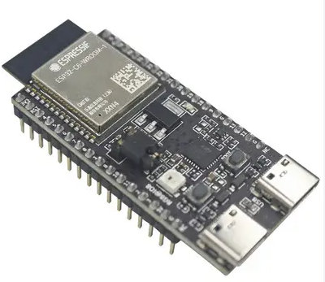

# 🧠 NL-001A — ESP32-C6 N16

> 🟢 Validé · 🟢 Sans outil · 👤 Débutant · ⏱️ 2 min · 💰 ~8 € · 🧩 Contrôleur principal

## 👀 En bref

Le **NL-001A** est la carte principale d'une station Natulib, basée sur un **ESP32-C6 avec 16 Mo de mémoire Flash**.

Elle exécute **Natulib OS**, pilote les modules connectés et assure les communications sans fil.

Elle permet notamment de :

- 🌱 exécuter Natulib OS ;
- 🌡️ lire les capteurs ;
- 📺 piloter les écrans ;
- ⚙️ commander les actionneurs ;
- 🌐 héberger l'interface Web locale ;
- 📡 communiquer en Wi-Fi 6, Bluetooth LE, Zigbee et Thread.

**Montage :** sans outil avec le [NL-002A](./NL-002A-ESP32-Expansion-Shield.md) · **Alimentation :** USB-C · **Logique :** 3,3 V.

> ⚠️ Choisissez la version **ESP32-C6 N16 avec broches déjà soudées**. La version sans broches nécessite une soudure avant de pouvoir être utilisée avec les modules Natulib.

---

## 📷 Aperçu

> 📷 *Photo à ajouter : `assets/NL-001A-ESP32-C6-N16-1.png`*

<!-- Décommentez cette ligne une fois la photo ajoutée :

-->

---

## 🛒 Ce qu'il vous faut

| Composant | Qté | Obligatoire | Fournisseur |
|---|--:|:-:|---|
| ESP32-C6 N16 avec broches soudées | 1 | ✅ | AliExpress |
| Câble USB-C (données) | 1 | ✅ | AliExpress |
| [NL-002A](./NL-002A-ESP32-Expansion-Shield.md) Expansion Shield 30 broches | 1 | ⭐ Recommandé | AliExpress |

> 💡 Les liens d'achat peuvent être affiliés et contribuer au développement de Natulib, sans coût supplémentaire pour vous.

---

## 🔌 Connexions principales

| Connecteur / broche | Fonction |
|---|---|
| **USB-C** | Alimentation 5 V, programmation et console série |
| **GPIO** | Connexion des capteurs, actionneurs et écrans |
| **3V3** | Alimentation 3,3 V des périphériques |
| **GND** | Masse commune |
| **BOOT / GPIO9** | Programmation et fonctions système |
| **RESET** | Redémarrage matériel |

### ⛔ GPIO réservés

| GPIO | Fonction |
|:---:|---|
| **GPIO8 · GPIO9** | Broches de *strapping* et bouton BOOT |
| **GPIO12 · GPIO13** | USB différentiel |
| **GPIO15** | Broche de *strapping* |
| **GPIO16 · GPIO17** | Console série UART0 |

> 💡 La console série utilise **115 200 bauds**.

> ⚠️ Le brochage exact varie selon le fabricant de la carte. Vérifiez la sérigraphie de la vôtre avant tout raccordement. Le GPIO effectivement utilisé par chaque module dépend du projet : voir sa fiche **[Projet](../Projets.md)**.

---

## ⚙️ Configuration Natulib OS

La carte n'est pas déclarée comme un module : elle **exécute** Natulib OS. Les GPIO utilisés par chaque périphérique sont définis dans la configuration du module concerné.

---

## 🛠️ Installation en 2 minutes

1. Vérifiez que les broches de l'ESP32-C6 sont déjà soudées.
2. Insérez la carte dans le **[NL-002A](./NL-002A-ESP32-Expansion-Shield.md)**.
3. Vérifiez l'orientation du connecteur USB-C.
4. Connectez les modules Natulib au shield.
5. Branchez le câble USB-C.

> 🔧 Aucun fer à souder n'est nécessaire avec une carte équipée de ses broches et le NL-002A.

---

## 🚀 Démarrage

Pour installer **Natulib OS**, suivez le [guide d'installation](../Installation.md).

### ⚡ Alimentation

- Utilisez une alimentation USB-C stable.
- Une alimentation **5 V / 1 A minimum** est recommandée.
- Coupez l'alimentation avant toute modification du câblage.

> ⚠️ Les GPIO de l'ESP32-C6 fonctionnent en **3,3 V**. N'appliquez jamais une tension supérieure directement sur une GPIO.

---

## 🧩 Problèmes courants

**La carte n'apparaît pas comme port série**
→ Le câble USB-C doit transporter les données, pas seulement l'alimentation.

**Le démarrage échoue après ajout d'un module**
→ Vérifiez qu'aucun module n'impose un niveau sur GPIO8, GPIO9 ou GPIO15 pendant la mise sous tension.

---

## 💡 À retenir

- **N16 = 16 Mo de Flash.**
- Préférez une carte avec **broches déjà soudées**.
- Le **NL-002A** permet de connecter les modules sans soudure.
- Vérifiez toujours la tension d'un périphérique avant de le connecter à une GPIO.
- La carte constitue le **cœur matériel de Natulib OS**.

---

## 🚧 Évolutions prévues

- [ ] Page de brochage détaillée par variante de carte
- [ ] Mesure de consommation en Deep Sleep
- [ ] Recommandations d'alimentation pour station autonome

---

## 🔗 Ressources

- 💾 [Installation de Natulib OS](../Installation.md)
- 🧠 [Natulib OS](../Natulib-OS.md)
- 🧪 [Natulib — Code source](https://github.com/Natulib/Natulib)

---

## 🕓 Historique

| Version | Évolution |
|---|---|
| A | Première carte principale Natulib basée sur ESP32-C6 N16 |
