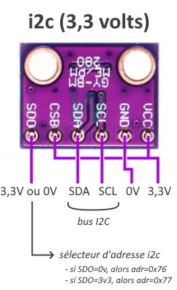

# 🌡️ NL-201A — BME280

> 🟢 Validé · 🟠 Soudure · 👤 Intermédiaire · ⏱️ 20 min · 💰 ~3 € · 🔌 I²C

Le **BME280** mesure la **température**, l'**humidité relative** et la **pression atmosphérique**.

Il permet à Natulib de :

- 🌡️ suivre la température ambiante ;
- 💧 suivre l'humidité relative de l'air ;
- 🌦️ suivre la pression atmosphérique ;
- 🌱 alimenter les recettes, les automatisations et Naturochi.

**Alimentation :** 3,3 V · **Adresse I²C :** `0x76` · **Calibration :** aucune.

> ⚠️ **Attention** — Vérifiez qu'il s'agit bien d'un **BME280** et non d'un **BMP280**, qui ne mesure pas l'humidité.

---

## 📷 Aperçu

 

---

## 🛒 Ce qu'il vous faut

|Composant|Qté|Obligatoire|Fournisseur|
|---|--:|:-:|---|
|Module BME280|1|✅|AliExpress|
|Barrette mâle 6 broches|1|⚠️|AliExpress|
|Câbles Dupont|6|✅|AliExpress|

> 💡 La majorité des modules BME280 sont livrés **sans broches soudées**.

---

## 🔌 Câblage

|BME280|ESP32-C6|Fonction|
|---|---|---|
|VCC|3V3|Alimentation|
|GND|GND|Masse|
|SDA|GPIO4|Données I²C|
|SCL|GPIO5|Horloge I²C|
|CSB|3V3|Active le mode I²C|
|SDO|GND|Adresse I²C `0x76`|

>💡 Ces GPIO sont les branchements recommandés pour une installation simple. Pour une station utilisant plusieurs modules, reportez-vous au câblage indiqué dans votre fiche **Projet**.

---

## 🛠️ Montage en 20 minutes

1. Soudez la barrette de broches si nécessaire.
2. Branchez le BME280 selon le tableau ci-dessus.
3. Placez la sonde dans un endroit ventilé, à l'écart des sources de chaleur.
4. Démarrez Natulib.
5. Ouvrez l'**interface web**.
6. Activez le **BME280** et rebootez.

**C'est tout.** Natulib détecte et configure automatiquement le capteur.

---

## 🧩 Problèmes courants

**Le capteur n'est pas détecté sur le bus** → Vérifiez `CSB → 3V3` et l'adresse sélectionnée par `SDO`.

**L'humidité n'est jamais renvoyée** → Le module est probablement un **BMP280**, qui ne mesure pas l'humidité.

**La température est systématiquement trop élevée** → Le capteur est trop proche de l'ESP32-C6 ou enfermé dans un boîtier non ventilé.

---

## 💡 À retenir

- Alimentez uniquement en **3,3 V**.
- Reliez **CSB au 3,3 V** pour utiliser le mode I²C.
- Reliez **SDO au GND** pour l'adresse **0x76**.
- Installez le capteur à l'extérieur du boîtier ou derrière une grille afin qu'il mesure réellement l'air ambiant.
- Évitez une exposition directe au soleil.
- Trois mesures fiables dans un seul module, pour une consommation faible.

---

## 🚧 Évolutions prévues

- [ ] Version prête à brancher, sans soudure
- [ ] Petit boîtier de protection ventilé
- [ ] Connecteur rapide 
- [ ] Support clipsable pour les boîtiers Natulib

---
## 🛠️ Pour aller plus loin — Configuration avancée

Le driver `bme280` est configuré automatiquement depuis l'interface web.

```json
{
  "id": "climat",
  "type": "bme280",
  "pins": {
    "sda": 4,
    "scl": 5
  },
  "interval_ms": 60000,
  "active": true
}
```

|Paramètre|Fonction|
|---|---|
|`pins`|Broches I²C (`sda`, `scl`)|
|`interval_ms`|Intervalle entre deux lectures (60 000 ms par défaut)|
|`active`|Active / désactive le module|

### Adresse I²C

Le driver recherche automatiquement le capteur à l'adresse `0x76`, puis `0x77` en cas d'échec.
Le champ `address` n'est actuellement pas utilisé par le driver.

---

## 🔗 Ressources

- ☀️ [NL-202A — BH1750](./NL-202A-BH1750.md)
- 🧱 [Retour au catalogue des modules](../Modules.md)

---

## 🕓 Historique

|Version|Évolution|
|---|---|
|A|Première intégration du BME280|

