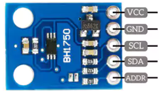

# ☀️ NL-202A — BH1750

> 🟢 Validé · 🟠 Soudure · 👤 Intermédiaire · ⏱️ 20 min · 💰 ~2 € · 🔌 I²C
---
Le **BH1750** mesure la **luminosité ambiante en lux**.

Il permet à Natulib de :

- ☀️ évaluer l'ensoleillement d'une plante ;
- 📈 suivre les variations de lumière au cours de la journée ;
- 🌱 alimenter les recettes et les états biologiques de Naturochi.

**Alimentation :** 3,3 V · **Adresse I²C :** `0x23` ou `0x5C` (Auto-détectée) · **Calibration :** aucune. 
**Multiplexage :** Support natif des multiplexeurs I²C (ex: TCA9548A) pour brancher plusieurs capteurs identiques. 

> 💡 La plupart des modules BH1750 sont livrés sans broches soudées : comptez une soudure de barrette avant le montage.

---

## 📷 Aperçu

<p ></p> 

---

## 🛒 Ce qu'il vous faut

| Composant | Qté | Obligatoire | Fournisseur |
|---|--:|:-:|---|
| Module BH1750 | 1 | ✅ | AliExpress |
| Câbles Dupont | 5 | ✅ | AliExpress |

> 💡 Les liens d'achat peuvent être affiliés et contribuer au développement de Natulib, sans coût supplémentaire pour vous.

---

## 🔌 Câblage

| BH1750 | ESP32-C6 | Fonction |
|---|---|---|
| VCC | 3V3 | Alimentation |
| GND | GND | Masse |
| SDA | GPIO4 | Données I²C |
| SCL | GPIO5 | Horloge I²C |
| ADDR | GND ou 3V3 | Adresse I²C (`0x23` si GND, `0x5C` si 3V3) |

> 💡 Les GPIO indiqués ci-dessus sont une **recommandation par défaut**, utilisable telle quelle pour un montage isolé. Dans une station qui combine plusieurs modules, le câblage réel peut différer : reportez-vous au plan de brochage de votre fiche **[Projet](../Projets.md)**.

---

## ⚙️ Configuration Natulib OS

**Type :** `bh1750`

```json
{
  "id": "soleil_lux",
  "type": "bh1750",
  "address": null,
  "mux_addr": null,
  "mux_channel": null,
  "pins": {
    "sda": 4,
    "scl": 5
  },
  "interval_ms": 60000,
  "active": true
}
```

⚙️ **Paramètres avancés :**

- **Plug & Play :** Laissez `address` sur `null` si vous n'avez qu'un seul BH1750. Natulib OS détectera automatiquement s'il est sur `0x23` ou `0x5C`.
- **Multi-capteurs :** Si vous utilisez deux capteurs, forcez `address` à `35` (décimal pour 0x23) pour le premier et `92` (décimal pour 0x5C) pour le second afin d'éviter toute inversion.
- **Multiplexeur :** Pour brancher plus de 2 capteurs, utilisez un multiplexeur (ex: TCA9548A). Renseignez `mux_addr` (ex: `112` pour 0x70) et `mux_channel` (de `0` à `7`).

---

## 🛠️ Montage en 20 minutes

1. Soudez la barrette de broches si le module en est dépourvu.
2. Connectez le BH1750 à l'ESP32-C6 selon le tableau de câblage.
3. Reliez **ADDR à GND** (pour l'adresse `0x23`) ou **au 3,3 V** (pour `0x5C`).
4. Positionnez le capteur face à la principale source de lumière.
5. Fixez le module sans masquer sa cellule.
6. Démarrez Natulib OS et vérifiez les mesures.

---

## 🧩 Problèmes courants

**Les valeurs restent proches de zéro**
→ La cellule est masquée par un cache, un boîtier ou un câble.

**Le capteur n'est pas détecté**
→ Le système détecte automatiquement les adresses `0x23` et `0x5C`. S'il n'est pas vu, vérifiez vos câbles SDA/SCL. Si vous utilisez plusieurs capteurs, assurez-vous d'avoir correctement forcé la clé `address` ou correctement configuré le canal du multiplexeur (`mux_channel`) dans le JSON.

---

## 💡 À retenir

- Alimentez le module en **3,3 V**.
- Le BH1750 mesure la **lumière visible**, pas l'ensoleillement au sens météorologique.
- Une vitre, un cache ou un boîtier opaque peut modifier fortement la mesure.
- Pour une installation extérieure, prévoyez une **fenêtre transparente** ou une protection adaptée.
- Évitez d'exposer directement le module à la pluie.

---

## 🚧 Évolutions prévues

- [ ] Petit capot de protection contre la pluie
- [ ] Boîtier Natulib avec fenêtre dédiée
- [ ] Connecteur rapide RJ45 / JST
- [ ] Support clipsable pour les boîtiers Natulib

---

## 🔗 Ressources

- 🌡️ [NL-201A — BME280](./NL-201A-BME280.md)
- 🧱 [Retour au catalogue des modules](../Modules.md)

---

## 🕓 Historique

| Version | Évolution |
|---|---|
| A | Première intégration du BH1750 |
